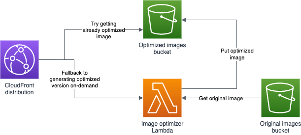

# S3 image optimization

The repository contains sample code for serving optimized variants of images stored in an S3 bucket. It uses a CloudFront distribution which has two origins. It first tries to fetch the already existing optimized version of an image from an S3 bucket an if that does not exist then invokes a Lambda function to optimize the image on-demand. The images get served in the best possible format based on the incoming Accept HTTP header. This functionality is handled by a CloudFront Function.

The solution should be easily deployable with the provided Terraform configuration.

## Architecture

Created by Vass Bence in 2023, released under the MIT license.
